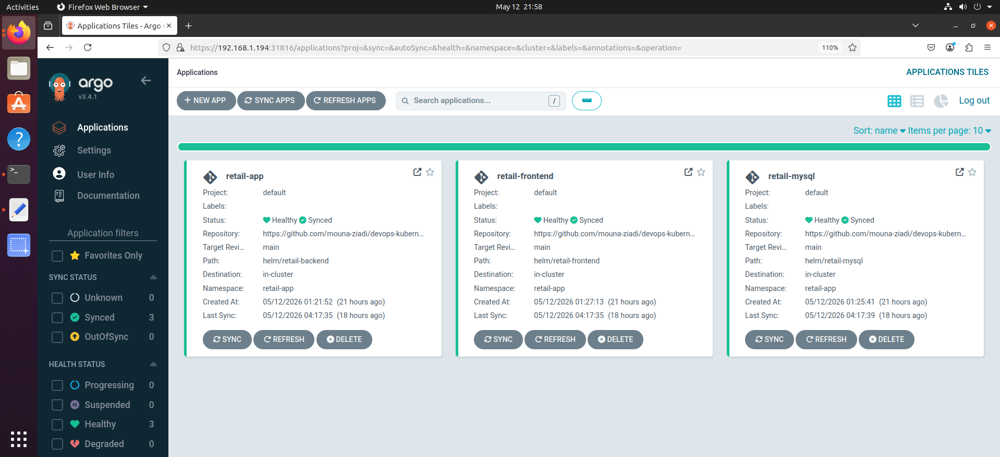
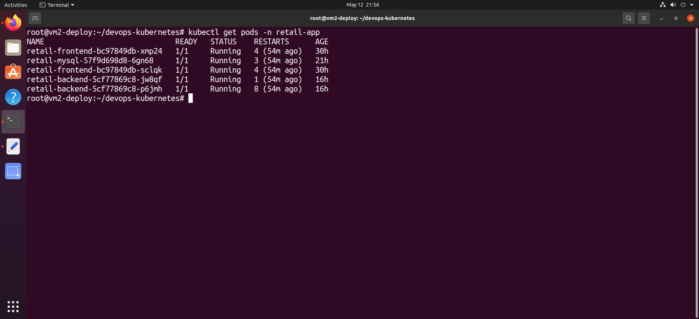
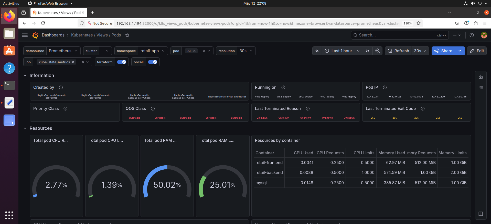
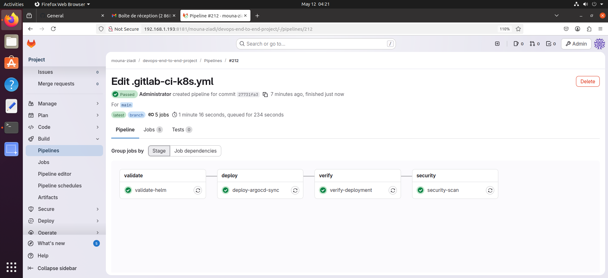

<div align="center">

# 🚀 Kubernetes deployment + CI/CD Pipeline
## For — 🛒 Retail Management System


**Production-grade Kubernetes deployment — automated via GitLab CI/CD pipeline with SSH deploy from VM1 to VM2.**

*Part of [devops-end-to-end](https://github.com/mouna-ziadi/devops-end-to-end) — Phase 3/3*

</div>

---

## 📸 Screenshots

### Application Running on Kubernetes


### ArgoCD — 3 Applications Healthy + Synced


### Pods Running


### Grafana Dashboard


### GitLab CI/CD Pipeline — 4 Stages


---

## 🏗️ Architecture

```
┌─────────────────────────────────────────────────────────────────┐
│                     VM1 — GitLab CE                             │
│             192.168.1.193 · 12GB RAM · Runner Shell             │
│                                                                 │
│   GitLab CI/CD Pipeline (.gitlab-ci-k8s.yml)                    │
│   ┌──────────┐  ┌──────────┐  ┌──────────┐  ┌──────────────┐    │
│   │ validate │→ │  deploy  │→ │  verify  │→ │    security │    │
│   │helm lint │  │  argocd  │  │ kubectl  │  │trivy+kubesec │    │
│   └──────────┘  └──────────┘  └──────────┘  └──────────────┘    │
└──────────────────────────┬──────────────────────────────────────┘
│ SSH (ed25519)
┌──────────────────────────▼──────────────────────────────────────┐
│                   VM2 — K3s Cluster                             │
│              192.168.1.194 · 8GB RAM · 60GB                     │
│                                                                 │
│  ┌───────────────────────────────────────────────────────────┐  │
│  │                 Namespace: retail-app                     │  │
│  │                                                           │  │
│  │  ┌────────────┐   ┌─────────────┐   ┌─────────────────┐   │  │
│  │  │   MySQL    │←──│   Backend   │←──│    Frontend    │   │  │
│  │  │  :3306     │   │   :8087     │   │     :4000       │   │  │
│  │  │ 1 replica  │   │  HPA 2→5   │   │   HPA 2→4       │   │  │
│  │  │ PVC 5Gi    │   │Spring Boot  │   │  Angular SSR    │   │  │
│  │  └────────────┘   └─────────────┘   └─────────────────┘   │  │
│  │         ▲                ▲                   ▲             │  │
│  │         └────────────────┴───────────────────┘             │  │
│  │                    Ingress Nginx                            │  │
│  │    retail.192.168.1.194.nip.io                             │  │
│  │    /api/* → backend:8087  |  /* → frontend:4000            │  │
│  └───────────────────────────────────────────────────────────┘  │
│                                                                 │
│  ┌───────────────────────────────────────────────────────────┐  │
│  │               Namespace: monitoring                       │  │
│  │   Prometheus:32001 · Grafana:32000 · Alertmanager:32002   │  │
│  │   Node Exporter · kube-state-metrics                      │  │
│  └───────────────────────────────────────────────────────────┘  │
│                                                                 │
│  ArgoCD NodePort :31816                                         │
└──────────────────────────┬──────────────────────────────────────┘
│ GitOps — auto sync
┌──────────────────────────▼──────────────────────────────────────┐
│            GitHub — devops-kubernetes (private)                 │
│         helm/ · k8s/ · argocd/ · docs/screenshots/             │
└─────────────────────────────────────────────────────────────────┘
```
---

## 🛠️ Stack technique

| Catégorie | Outil | Version | Rôle |
|-----------|-------|---------|------|
| Orchestration | K3s | v1.28.8 | Kubernetes lightweight single-node |
| Package Manager | Helm | v3.20.2 | Templating et déploiement des charts |
| GitOps | ArgoCD | v3.4.1 | Synchronisation GitHub → K8s |
| Ingress | Nginx Ingress Controller | latest | Reverse proxy + routing HTTP |
| Autoscaling | HPA v2 | K8s built-in | Scale automatique CPU-based |
| Monitoring | kube-prometheus-stack | latest | Prometheus + Grafana + Alertmanager |
| Métriques | Node Exporter + kube-state-metrics | latest | Métriques VM + K8s objects |
| Sécurité | Trivy | latest | Scan CVE images Docker |
| Sécurité | kubesec | v2 | Analyse sécurité manifests K8s |
| CI/CD | GitLab CE | local | Pipeline 4 stages via runner shell |
| DNS | nip.io | - | DNS wildcard sans configuration |

---

## 📁 Project Structure

```
devops-kubernetes/
├── helm/
│   ├── retail-mysql/                # MySQL 8.0
│   │   ├── Chart.yaml
│   │   ├── values.yaml
│   │   └── templates/
│   │       ├── deployment.yaml      # Liveness + Readiness probes
│   │       ├── service.yaml         # Headless ClusterIP
│   │       └── pvc.yaml             # PVC 5Gi local-path
│   ├── retail-backend/              # Spring Boot 3.4
│   │   ├── Chart.yaml
│   │   ├── values.yaml
│   │   └── templates/
│   │       ├── deployment.yaml      # initContainer wait-for-mysql
│   │       ├── service.yaml         # ClusterIP :8087
│   │       └── hpa.yaml             # HPA v2 — 2 à 5 replicas
│   └── retail-frontend/             # Angular 17 SSR
│       ├── Chart.yaml
│       ├── values.yaml
│       └── templates/
│           ├── deployment.yaml      # NODE_ENV=production
│           ├── service.yaml         # ClusterIP :4000
│           └── hpa.yaml             # HPA v2 — 2 à 4 replicas
├── k8s/
│   ├── namespace.yaml               # retail-app + monitoring
│   ├── configmap.yaml               # SPRING_DATASOURCE_URL, SERVER_PORT...
│   ├── secrets.yaml                 # MYSQL_ROOT_PASSWORD, JWT_SECRET...
│   └── ingress.yaml                 # Routing nip.io
├── argocd/
│   └── retail-app.yaml              # ArgoCD Application — auto sync + prune
└── docs/
└── screenshots/                 # Captures du projet

```

---

## 🚀 Déploiement from scratch

### Prérequis sur VM2
```bash
# Vérifier les outils installés
kubectl version --client    # K3s v1.28+
helm version                # v3.20+
argocd version --client     # v2.9+
```

### Étape 1 — Appliquer les manifests de base
```bash
kubectl apply -f k8s/namespace.yaml
kubectl apply -f k8s/configmap.yaml
kubectl apply -f k8s/secrets.yaml
kubectl apply -f k8s/ingress.yaml

# Vérification
kubectl get namespace | grep -E "retail-app|monitoring"
kubectl get configmap -n retail-app
kubectl get secret -n retail-app
```

### Étape 2 — Déployer via Helm
```bash
# Ordre important : MySQL d'abord
helm upgrade --install retail-mysql helm/retail-mysql -n retail-app
helm upgrade --install retail-backend helm/retail-backend -n retail-app
helm upgrade --install retail-frontend helm/retail-frontend -n retail-app

# Vérifier le lint avant déploiement
helm lint helm/retail-mysql
helm lint helm/retail-backend
helm lint helm/retail-frontend
```

### Étape 3 — Vérifier le déploiement
```bash
# Pods
kubectl get pods -n retail-app -w

# HPA
kubectl get hpa -n retail-app

# Services
kubectl get svc -n retail-app

# Ingress
kubectl get ingress -n retail-app

# Helm releases
helm list -n retail-app
```

### Étape 4 — Installer le monitoring
```bash
helm repo add prometheus-community https://prometheus-community.github.io/helm-charts
helm repo update

helm upgrade --install monitoring prometheus-community/kube-prometheus-stack \
  --namespace monitoring \
  --set grafana.service.type=NodePort \
  --set grafana.service.nodePort=32000 \
  --set prometheus.service.type=NodePort \
  --set prometheus.service.nodePort=32001 \
  --set alertmanager.service.type=NodePort \
  --set alertmanager.service.nodePort=32002 \
  --set prometheus.prometheusSpec.podMonitorSelectorNilUsesHelmValues=false \
  --set prometheus.prometheusSpec.serviceMonitorSelectorNilUsesHelmValues=false
```

---

## 🔄 GitOps avec ArgoCD

ArgoCD surveille ce repo GitHub en continu. Chaque `git push` sur `main` déclenche une synchronisation automatique vers le cluster K3s.

git push → ArgoCD détecte → sync automatique → K8s mis à jour

### Sync Policy configurée
```yaml
syncPolicy:
  automated:
    prune: true      # Supprime les ressources obsolètes
    selfHeal: true   # Réconcilie toute dérive manuelle
```

### État des applications

| Application | Source | Namespace | Health | Sync |
|-------------|--------|-----------|--------|------|
| retail-app | helm/retail-backend | retail-app | ✅ Healthy | ✅ Synced |
| retail-frontend | helm/retail-frontend | retail-app | ✅ Healthy | ✅ Synced |
| retail-mysql | helm/retail-mysql | retail-app | ✅ Healthy | ✅ Synced |

### Accès ArgoCD
```bash
# Récupérer le mot de passe admin
kubectl get secret argocd-initial-admin-secret -n argocd \
  -o jsonpath='{.data.password}' | base64 -d

# UI disponible sur
https://192.168.1.194:31816
```

---

## 📊 Monitoring

Stack **kube-prometheus-stack** déployée via Helm dans le namespace `monitoring`.

### Composants

| Composant | NodePort | Rôle |
|-----------|----------|------|
| Grafana | :32000 | Dashboards CPU / RAM / Network |
| Prometheus | :32001 | Collecte et stockage métriques |
| Alertmanager | :32002 | Routage et gestion des alertes |
| Node Exporter | — | Métriques système VM2 |
| kube-state-metrics | — | Métriques objets K8s |

### Dashboards Grafana importés

| Dashboard | ID Grafana | Description |
|-----------|-----------|-------------|
| Kubernetes / Views / Pods | 15760 | CPU/RAM par pod et namespace |
| Node Exporter Full | 1860 | Métriques complètes VM2 |

### Credentials Grafana

URL      : http://192.168.1.194:32000
Username : admin
Password : kubectl --namespace monitoring get secrets monitoring-grafana 
-o jsonpath="{.data.admin-password}" | base64 -d

---

## ⚙️ Pipeline CI/CD GitLab

Pipeline 4 stages déclenchée automatiquement à chaque push sur `main`.

┌──────────┐    ┌──────────┐    ┌──────────┐    ┌──────────────┐
│ validate │ →  │  deploy  │ →  │  verify  │ →  │   security   │
│          │    │          │    │          │    │              │
│helm lint │    │argocd    │    │kubectl   │    │trivy image   │
│3 charts  │    │sync x3   │    │get pods  │    │kubesec scan  │
│          │    │auto wait │    │get hpa   │    │allow_failure │
└──────────┘    └──────────┘    └──────────┘    └──────────────┘

### Variables GitLab requises

| Variable | Description | Masked |
|----------|-------------|--------|
| `VM2_HOST` | IP de VM2 : `192.168.1.194` | ❌ |
| `VM2_USER` | Utilisateur SSH : `root` | ❌ |
| `SSH_PRIVATE_KEY` | Clé privée ed25519 de VM1 | ✅ |
| `ARGOCD_SERVER` | `192.168.1.194:31816` | ❌ |
| `ARGOCD_PASSWORD` | Mot de passe admin ArgoCD | ✅ |

### Résultat pipeline

| Stage | Job | Statut |
|-------|-----|--------|
| validate | validate-helm | ✅ Passed |
| deploy | deploy-argocd-sync | ✅ Passed |
| verify | verify-deployment | ✅ Passed |
| security | security-scan | ⚠️ Warning (allow_failure) |

---

## 🔑 Points techniques clés

### Pattern 12-Factor App
Tous les secrets et configurations sont externalisés via ConfigMap et Secret Kubernetes — jamais hardcodés dans les images.

### InitContainer wait-for-mysql
Le backend Spring Boot utilise un initContainer `busybox` qui attend que MySQL soit joignable avant de démarrer, évitant les CrashLoopBackOff au premier déploiement.

```yaml
initContainers:
  - name: wait-for-mysql
    image: busybox:1.35
    command:
      - sh
      - -c
      - until nc -z retail-mysql 3306; do sleep 3; done
```

### HPA v2 — Autoscaling CPU-based
```yaml
# Backend : scale de 2 à 5 replicas à 70% CPU
# Frontend : scale de 2 à 4 replicas à 70% CPU
```

### DNS nip.io — Zero configuration
Aucune modification de `/etc/hosts` nécessaire — `retail.192.168.1.194.nip.io` se résout automatiquement vers `192.168.1.194`.

### Ingress routing

/api/*  →  retail-backend:8087   (Spring Boot REST API)
/*      →  retail-frontend:4000  (Angular SSR)

### StorageClass local-path
K3s fournit nativement `local-path` comme StorageClass par défaut — utilisé pour le PVC MySQL sans configuration supplémentaire.

---

## 🌐 URLs d'accès

| Service | URL | Credentials |
|---------|-----|-------------|
| Application | http://retail.192.168.1.194.nip.io | selon DB |
| ArgoCD | https://192.168.1.194:31816 | admin / voir secret |
| Grafana | http://192.168.1.194:32000 | admin / voir secret |
| Prometheus | http://192.168.1.194:32001 | — |
| Alertmanager | http://192.168.1.194:32002 | — |

---

## 📋 Commandes utiles

```bash
# État général du cluster
kubectl get all -n retail-app

# Logs backend
kubectl logs -l app=retail-backend -n retail-app --tail=50

# Logs frontend
kubectl logs -l app=retail-frontend -n retail-app --tail=50

# Describe pod en erreur
kubectl describe pod <pod-name> -n retail-app

# Test DNS interne
kubectl run dns-test --image=busybox:1.35 --rm -it --restart=Never \
  -n retail-app -- sh -c "nc -zv retail-mysql 3306 && echo OK"

# Helm rollback si besoin
helm rollback retail-backend 1 -n retail-app

# ArgoCD sync manuel
argocd app sync retail-app --insecure
```

---

## 👩‍💻 Auteure

**Mouna Ziadi** — Cloud & DevOps Engineer  

[](https://linkedin.com/in/mouna-ziadi-735174241)
[](https://github.com/mouna-ziadi)

---

## 🔗 Projet complet

Ce repo fait partie du projet **DevOps End-to-End** :

| Phase | Repo | Status |
|-------|------|--------|
| Phase 1 — CI/CD | [devops-cicd-pipeline](https://github.com/mouna-ziadi/devops-cicd-pipeline) | ✅ Terminé |
| Phase 2 — Docker Compose | [devops-docker-compose](https://github.com/mouna-ziadi/devops-docker-compose) | ✅ Terminé |
| Phase 3 — Kubernetes | [devops-kubernetes](https://github.com/mouna-ziadi/devops-kubernetes) | ✅ Terminé |
| Vue globale | [devops-end-to-end](https://github.com/mouna-ziadi/devops-end-to-end) | 🔄 En cours |


